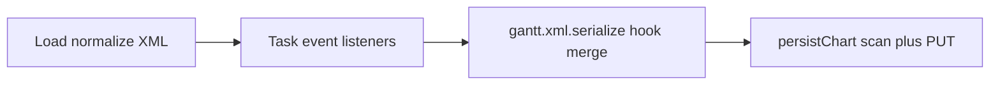

# Gantt chart GGTC task extensions (`ggtc_task_*`)

This project stores Kanban-compatible task status and closed-reason on each Gantt chart task as XML attributes (`ggtc_task_status`, `ggtc_task_closed_reason`) on the chart XML files. No extra database tables are used.

## Where enrichment happens

1. **Load (fetch from backend)**  
   `GgtcDhtmlxGanttExtensionsManager.normalizeXmlTasksWithExtensionAttrs` runs on XML returned by `getProjectChart` before `gantt.parse`, so tasks missing attributes get them on the **string** passed into DHTMLX.

2. **Runtime (editors and task lifecycle)**  
   `GgtcDhtmlxGanttExtensionsManager.ensureTaskObjectAttrs` runs from DHTMLX event listeners (e.g. after task add/update) so in-memory task objects stay consistent.

3. **Serialization (XML output from DHTMLX)**  
   `gantt.xml.serialize` is replaced once in [`frontend/src/spas/project-manager/lib/dhtmlx-gantt-adapter.ts`](../frontend/src/spas/project-manager/lib/dhtmlx-gantt-adapter.ts).  
   [`injectGgtcTaskAttributesIntoSerializedXml`](../frontend/src/spas/project-manager/lib/ggtc-dhtmlx-gantt-xml-serialize.ts) merges **only** what is already present on each runtime task from `getTask()` (plus `type`). It does **not** call `ensureTaskObjectAttrs` or apply defaults. If hooks failed, attributes can be missing from the serialized XML.

## Where enrichment does **not** happen: Save / persist

The **Save** flow and the **Gantt chart file manager** must not add or patch GGTC attributes as a separate “save-time enrichment” step.

- [`useGanttChartFileManager` `persistChart`](../frontend/src/spas/project-manager/hooks/use-gantt-chart-file-manager.ts) takes `getSerializedXml()` and uploads that string. It does **not** call `injectGgtcTaskAttributesIntoSerializedXml` or `normalizeXmlTasksWithExtensionAttrs`.
- After building the XML string, `persistChart` runs `scanXmlForMissingExtensionAttrs` on the **exact** payload that would be sent. That scan is an **enforcement / diagnostic** gate: if required attributes are still missing, the chart is still saved (per product rules), but the UI can warn that hooks or serializer merge were insufficient—developers should treat that as a bug to fix in load path or listeners.

## Mental model

Enforcement is **not** a second merge; it validates that the string produced for upload is complete.

## Related docs

- Milestone inference rules (Tasks page): [gant-chart-milestones.md](./gant-chart-milestones.md)
- High-level PM / Gantt context: [design.md](./design.md)
